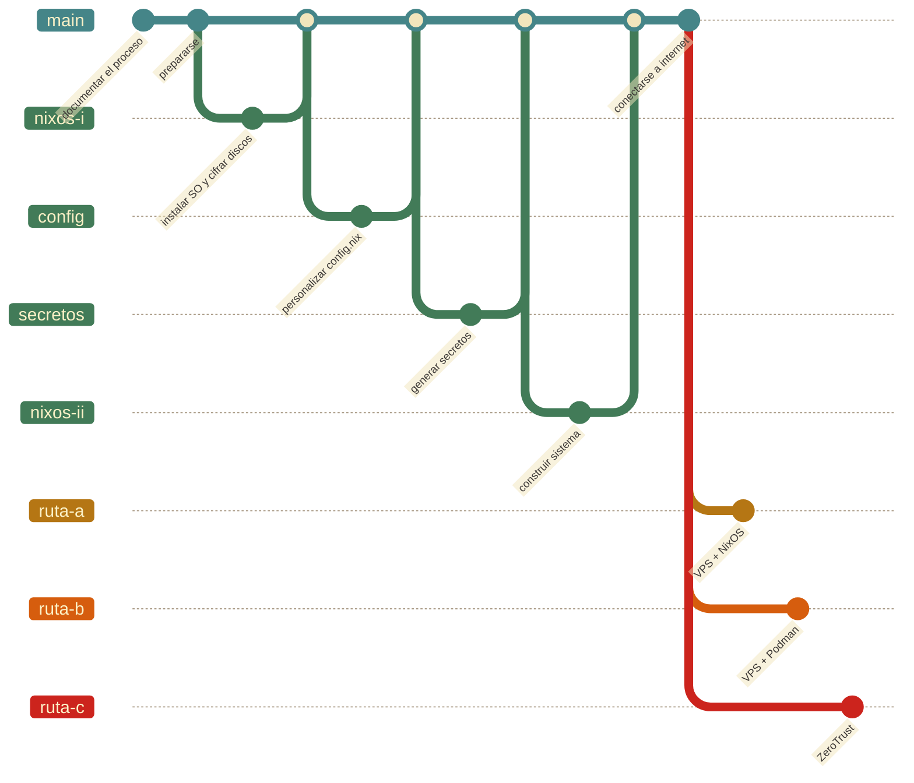

# `replicación`

← [Inicio](../../README.md#la-replicación)

## La complejidad

Replicar una `midu` requiere de tiempo y trabajo. Es un proceso complejo, no es difícil pero reconocemos que existe una curva de aprendizaje para toda persona o comunidad que decida aprender a configurar y personalizar la `interfaz` con la que `interactúa` con sus `datos`, la posibilidad de participar activamente en un ejercicio de `gobernanza participativa` nos invita a imaginar el lugar que queremos ocupar en las **infraestructuras humanas** que nos sea posible `construir` gracias a las **infraestructuras digitales y físicas** que estamos `desplegando`. En el proceso queremos entender que la posibilidad de `soberanía` nos exije de `autonomía` y `responsabilidad`, dos habilidades igualmente necesarias a la hora de `cuidar` la `vida`.

En los `Conspiratorios populares de las soberanías` nos interesa darle `cuerpo` a una `entidad` que se nos ha descrito como `abstracta`; **"la nube"**, al igual que la **inteligencia artificial**, funcionan como formas de simplificar, agrupar e invisibilizar las `infraestructuras` que las hacen posibles; observar y manipular su `materialidad` nos permite interiorizar una gran cantidad de prácticas de `cuidado`. Esta es una `interpretación` de conceptos que, traducidos a técnicas, buscan garantizar la `viabilidad` de la `midu` y de nuestras `memorias colectivas`.

Más allá de ser un proceso técnico, la replicación es un ejemplo de `transdisciplinariedad`: las `subjetividades` que pretendemos `transferir` están compuestas de reflexiones sobre la **confianza** y el **cuidado colectivo**, las decisiones técnicas operan como representaciones concretas de una serie de **principios** y **valores**.

## El descubrimiento

Puede ser que mucha de esta información nos resulte nueva y confusa al principio. Eso está bien, significa que acabamos de encontrar un mundo que no conocíamos, debemos aprender a `comunicarnos` en un nuevo `lenguaje`, crear nuestras propias `relaciones` para interpretarlo. Toda esta información está dispuesta para facilitar ese aprendizaje, la `documentación` de la experiencia de `replicación` es parte del proceso de `transferencia`.

### La documentación como práctica pedagógica continua

Documentar el proceso de `replicación` es parte del proceso mismo. Registrar las decisiones que tomamos, los obstáculos que encontramos y las adaptaciones que hacemos convierte cada `replicación` en una práctica pedagógica: el conocimiento que generamos puede transferirse a quien venga después.

> [Documentar el proceso de `replicación`](replicación/documentación.md)

### Los preparativos

Para prepararnos podemos empezar por `respirar` y disponernos en una actitud semejante a aquella en la que se inicia una exploración. La naturaleza colectiva de los `Conspiratorios populares de las soberanías` nos invita a no hacerlo solos; sin embargo, este material pretende contener lo necesario para `replicar` la `midu` por cuenta propia, de manera `autónoma`.

> [Preparativos](replicación/preparativos.md)

### El sistema operativo: nixos I

[NixOS](arquitectura/nixos.md) es el `sistema operativo` de la `midu`. La primera fase de la replicación cubre tres pasos: instalar NixOS en el disco principal, cifrar los dos discos con LUKS, y configurar el acceso remoto por SSH en la fase de arranque para poder desbloquear el `computador` de forma remota.

> [Instalación y cifrado de discos duros](replicación/nixos.md)

### Personalizar la configuración

`config.nix` conecta la configuración genérica del repositorio con los valores específicos de cada instalación: nombre del `computador`, idioma del sistema, UUIDs de los discos, dominio. Este paso consiste en copiar la plantilla y completar cada campo.

> [Personalizar configuración: `config.nix`](replicación/configuración.md)

### Generar secretos

Los servicios de la `midu` necesitan contraseñas, tokens y claves para funcionar. Este paso genera las claves de cifrado con [age](../lenguaje_común/lenguaje_común.md#age) y cifra los secretos con [sops](../lenguaje_común/lenguaje_común.md#sops) para que puedan ser leídos por los servicios del sistema.

> [Generar secretos](replicación/secretos.md)

### El sistema operativo: nixos II

Una vez hemos completado `config.nix` y cifrado los secretos, el sistema puede construirse por primera vez. Este paso clona el repositorio, enlaza la configuración de NixOS y ejecuta la primera construcción del sistema.

> [Clonar el `repositorio` y construir el sistema](replicación/nixos.md#paso-6-clonar-el-repositorio-y-construir-el-sistema)

### Conectarse a internet

La `midu` necesita un intermediario con IP pública fija para recibir tráfico desde internet. Hay tres rutas posibles; la elección determina el nivel de `exposición` del tráfico entrante y saliente.

> [Servicios de internet, nombres de dominio y rutas](conectarse_a_internet.md)

#### El `computador` desechable

El [servidor virtual privado](../lenguaje_común/lenguaje_común.md#vps) es el punto de entrada público de la `midu`, un `computador` arrendado en "la nube" que actúa como intermediario. Es desechable por diseño: la estrategia consiste en poder reemplazarlo sin perder ningún `dato`. El túnel ZeroTrust es una `abstracción` de la idea del `computador` **desechable**, en este caso lo que sería desechable es la `cuenta` asociada a los recursos de Cloudflare que usaremos.

> [Despliegue del VPS](replicación/vps.md)
> [Túnel ZeroTrust](servicios/zero_trust.md)

## La secuencia de replicación

| Paso | Contenido | Tiempo estimado |
|---------|-----------|-----------------|
| [Documentar el proceso](replicación/documentación.md) | Registrar decisiones, obstáculos y adaptaciones durante la `replicación` | Continuo |
| [Prepararse](replicación/preparativos.md) | Hardware, herramientas y conocimientos previos | 15 min (lectura) |
| [Instalar NixOS y cifrar discos](replicación/nixos.md) | Configurar el SO, cifrado LUKS, SSH en initrd | 45–90 min |
| [Personalizar la configuración](replicación/configuración.md) | Completar `config.nix` con los valores del `computador` | 20–30 min |
| [Generar los secretos](replicación/secretos.md) | Claves age, sops-nix, cifrado de secretos y LUKS | 30–45 min |
| [Construir el sistema](replicación/nixos.md#paso-6-clonar-el-repositorio-y-construir-el-sistema) | Clonar el `repositorio`, enlazar la configuración y ejecutar la primera construcción | 20–30 min |
| [Conectarse a internet](conectarse_a_internet.md) | Elegir una alternativa | 10 min |
| [Desplegar un VPS](replicación/vps.md) | Despliegue del punto de entrada público (Ruta A o B) | 30–60 min |
| [Crear un túnel ZeroTrust](servicios/zero_trust.md) | Crear una cuenta en Cloudflare y configurar el túnel | 30 min |

**Tiempo total estimado para el proceso de `replicación`: 4-6 horas.**

Los pasos están diseñados para seguirse en esta secuencia. Hay dependencias entre ellos: no podemos cifrar secretos antes de tener la clave age, y no podemos construir el sistema antes de tener los secretos cifrados.



## La posibilidad del error

NixOS cuenta con una función para devolverse al último estado estable del sistema: el [rollback](../lenguaje_común/lenguaje_común.md#rollback). Si hacemos una modificación y la construcción falla o el sistema queda en un estado inesperado, podemos volver a la configuración anterior desde el menú de arranque (GRUB) o con:

```bash
nixos-rebuild switch --rollback
```

El sistema está diseñado para ser reversible.