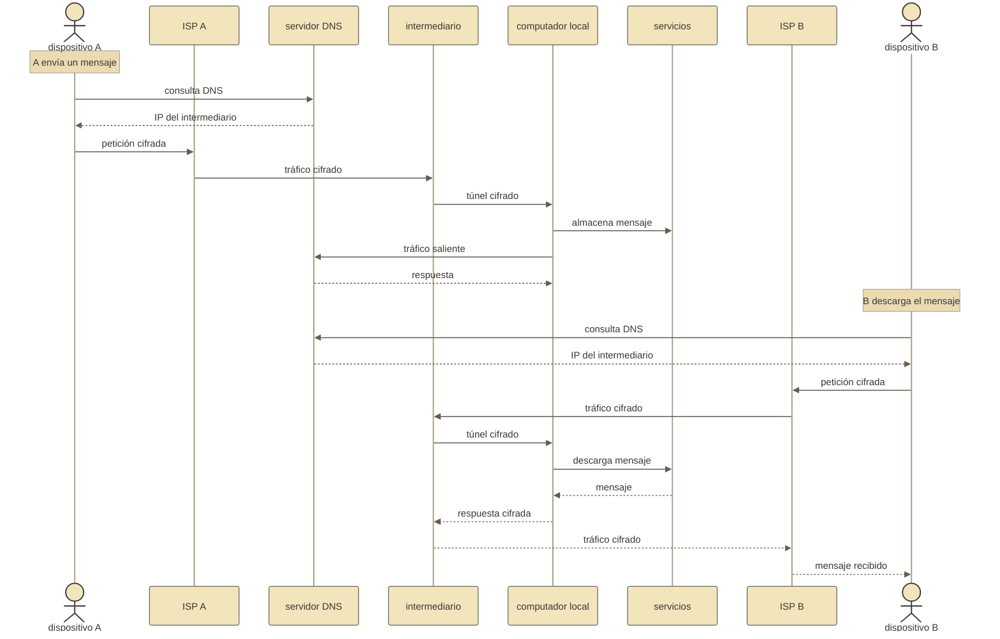

# Preparativos
← [`replicación`](../replicación.md)

## ¿Qué necesitamos?
### Conexión a internet

La `midu` necesita una `conexión` a `internet` **estable** para que sus servicios sean accesibles desde fuera de la red local. La conexión doméstica convencional es suficiente; lo que importa es entender qué actores participan entre el `computador` local y el resto de internet.

El [ISP](../../lenguaje_común/lenguaje_común.md#isp) (Proveedor de servicios de internet) es la empresa que conecta hogares y oficinas con internet. Asigna una dirección [IP](../../lenguaje_común/lenguaje_común.md#ip) al router que nos entregan con el contrato; en el caso de servicios residenciales esa IP es `dinámica` y puede cambiar sin previo aviso. El ISP también suele bloquear los puertos de entrada estándar (80, 443), lo que impide recibir conexiones externas directas. Por eso la `midu` necesita un intermediario con IP pública fija: Cloudflare o un VPS (Servidor virtual privado) propio.

Imaginemos dos personas en ubicaciones físicas distintas intercambiando mensajes entre ellas a través de la `midu`.

Las [tres rutas](../conectarse_a_internet.md) difieren en quién es ese intermediario, quién controla el DNS autoritativo de la `midu` y cuánta visibilidad tiene el ISP sobre ese tráfico.

### Suministro estable de energía

El `computador` va a estar encendido todo el tiempo; los servicios estarán disponibles siempre que el `computador` tenga acceso a energía e internet.

Un corte eléctrico abrupto puede corromper los `datos` que estaban siendo escritos en disco en ese momento. Para proteger la integridad de las `memorias`, se recomienda conectar el `computador` a un sistema de [UPS](../../lenguaje_común/lenguaje_común.md#ups) (suministro ininterrumpido de potencia). El UPS combina batería y regulador de voltaje: mantiene el suministro durante cortes breves y envía señal al `computador` para que se apague de forma ordenada cuando la batería se agota.

Un UPS de 600–1000 VA es suficiente para un mini-PC de bajo consumo. Es recomendable buscar modelos compatibles con el protocolo "Network UPS Tools (NUT)", esto permite automatizar el apagado cuando la carga baja de un umbral configurable. Conectar el UPS es opcional pero altamente recomendado; sin él, un corte de luz puede producir la corrupción de todo el sistema.

### Un `dominio` en internet

Un dominio es el nombre que las personas usan para encontrar los servicios de la `midu` en internet. Para que ese nombre funcione, dos actores tienen que estar de acuerdo sobre a dónde apunta.

El **[registrador de dominio](../../lenguaje_común/lenguaje_común.md#registrador-de-dominio)** es la empresa donde se compra y renueva el nombre. Controla qué servidores de nombres (nameservers) son autoritativos para ese dominio: es decir, decide qué servidor [DNS](../../lenguaje_común/lenguaje_común.md#dns) es la fuente de verdad para las consultas sobre ese nombre. Cambiar los nameservers en el registrador redirige todas las consultas hacia otro proveedor.

El **servidor DNS** responde esas consultas: cuando alguien escribe `mail.tusitio.com`, su `dispositivo` consulta el servidor DNS autoritativo del dominio para saber a qué IP dirigirse. El servidor DNS puede estar gestionado por el propio registrador o delegado a un tercero como Cloudflare. La elección de ruta en la `midu` determina quién gestiona esa zona DNS y qué registros contiene.

| Campo | Registrador de dominio | VPS o Cloudflare | `computador` local |
|---|---|---|---|
| **Nombre del dominio** | Se registra y renueva aquí | Configurado en el reverse proxy y el túnel | Declarado en `config.nix` y en Caddy |
| **Nameservers** | Se configuran aquí; apuntan a Cloudflare (Ruta C) o al servidor DNS del registrador (Rutas A y B) | Cloudflare gestiona su propia zona; el VPS usa los nameservers del registrador | No aplica |
| **Registros A o CNAME** | Se crean en la zona DNS si los nameservers son del registrador | IP fija del VPS o red de Cloudflare como destino | IP privada; no entra en DNS público |
| **Subdominios de servicios** | Se crean aquí, o en Cloudflare si los nameservers son de Cloudflare | Traefik los recibe en el VPS y los reenvía | Caddy los dirige al servicio correcto |
| **Certificados [TLS](../../lenguaje_común/lenguaje_común.md#tls)** | No participa | Cloudflare gestiona los suyos; el VPS usa [Let's Encrypt](../../lenguaje_común/lenguaje_común.md#lets-encrypt) | Caddy renueva automáticamente |

Más detalles en [conectarse a internet: ISP, DNS y registrador de dominio](conectarse_a_internet.md#isp-dns-y-registrador-de-dominio).

### Un `computador` local

El `computador` que vamos a configurar será la máquina que `ejecuta` todos los `servicios` que usaremos. Será la primera de nuestras `anfitrionas` ([hosts](../arquitectura/hosts.md)). Vamos a usar, en este primer caso de configuración, dos `Discos Duros` de estado sólido _SSD_ del tipo _NVMe_. Estos representarán los _niveles 0 y 1_ de nuestro modelo de `resiliencia` de las `memorias`.

- **2 Discos [NVMe](../../lenguaje_común/lenguaje_común.md#nvme)**: uno para el sistema operativo (`nvme0`) y otro para los `datos` de las aplicaciones (`nvme1`). La separación permite `cifrar` cada disco de manera independiente, y protege los `datos` de las aplicaciones incluso si el Sistema Operativo se reinstala o compromete.
- **Memoria RAM**: 8 GB mínimo, 16 GB recomendado. Los servicios de correo, base de `datos` y mensajería corren simultáneamente, cada servicio adicional consume `recursos` de esa memoria, así que hay que encontrar una configuración de servicios que se ajuste a las posibilidades de cada `contexto`.
- Opcionalmente, un **tercer disco de almacenamiento** (llamado `storage` en la configuración) para archivos multimedia u otros archivos grandes. Este disco no se cifra durante la instalación inicial. 

### Un `computador` desechable en "la nube"
#### Cloudflare - ZeroTrust

Existe una **alternativa comercial** que nos ofrece una _cuota de uso gratuito_ que, para las necesidades usuales de un individuo u organización pequeña, es suficiente. En este caso el `computador` en "la nube" está oculto detrás de un `servicio` que nos permite crear un `tunel cifrado` sin necesidad de configurarlo. 

Para usar esta alternativa (ruta C) necesitaremos:
- Una cuenta en Cloudflare: [redireccionar](https://www.youtube.com/watch?v=dwjXNYoeWSw) apropiadamente el `dominio` en el proveedor que hayamos elegido para registrarlo.
- Crear el túnel de [ZeroTrust](https://www.youtube.com/watch?v=MyJlI_pRGKs): obtener un `token` de acceso y agregarlo al archivo de [secretos](secretos.md).
#### VPS (Servidor Virtual Privado)

El [VPS](../../lenguaje_común/lenguaje_común.md#vps) es un `computador` arrendado a un tercero en **"la nube"**, esta será nuestra segunda máquina `anfitriona` y actuará como un punto de entrada y salida a lo que conocemos como la `internet`. El `computador` local estará protegido dentro de nuestra red doméstica y sólo se comunicará con el VPS a través de un `túnel cifrado` que nos permitirá redireccionar los mensajes que enviamos y recibimos a través de la **IP fija** de la VPS a nuestro `computador` local.

El `computador` local está detrás de un [Traductor de direcciones de red - NAT](../../lenguaje_común/lenguaje_común.md#nat) que se comunica a través de una IP pública compartida que nos asigna el [Prestador de servicios de internet - ISP](../../lenguaje_común/lenguaje_común.md#isp) de manera temporal, es decir, cambia sin previo aviso.

El `computador` en "la nube" es **desechable** porque no podemos confiar en el tercero que nos lo arrienda, así que la estrategia es que poder cambiar de proveedor sin perder o poner en riesgo nuestro `computador` local. En principio cualquier proveedor funciona: Hetzner, DigitalOcean, Vultr, Linode, OVH, etc. Los requisitos son mínimos:

- 1 vCPU, 512 MB–1 GB RAM
- **IP pública fija**
- Sistema operativo: NixOS (Ruta A) o cualquier Linux con Docker/Podman (Ruta B)

> Más detalles sobre la [ruta A](conectarse_a_internet.md#ruta-a-vps-con-nixos--pangolin--newt)
> Más detalles sobre la [ruta B](conectarse_a_internet.md#ruta-b-vps-con-podman-sin-nixos)
> Más detalles sobre el [VPS](vps.md).

### Una `memoria` USB

Necesitas una memoria USB para arrancar el instalador de [NixOS](../../lenguaje_común/lenguaje_común.md#nixos). Cualquier USB de 4 GB o más sirve. Se puede descargar la ISO de instalación desde [nixos.org](https://nixos.org/download/).

## Conocimientos útiles

Estos conocimientos son útiles pero no son un prerequisito bloqueante. La documentación explica cada paso en detalle.

| Conocimiento | Para qué sirve | ¿Bloqueante sin él? |
|-------------|----------------|---------------------|
| Comandos básicos de Linux (`ls`, `cd`, `cp`, `cat`, `echo`) | Navegar el sistema de archivos durante la instalación | No, cada comando se explica |
| Qué es [SSH](../../lenguaje_común/lenguaje_común.md#ssh) y cómo usarlo | Conectarse remotamente al servidor | No, se explica en el paso de initrd |
| Qué es git y cómo clonar un repositorio | Obtener el código de la `interfaz` | No, el comando se da completo |
| Qué es una dirección IP | Identificar el servidor en la red | No, se explica en el glosario |

Lo que sí ayuda es paciencia y disposición a leer los mensajes de error. NixOS es explícito cuando algo sale mal.

## Herramientas

Las siguientes herramientas se usan durante la instalación pero **no necesitan instalarse manualmente**. Se invocan con `nix-shell -p <herramienta>`, que las descarga y las pone disponibles temporalmente:

| Herramienta | Para qué sirve |
|-------------|----------------|
| `git` | Clonar el repositorio de la `interfaz` |
| `age` | Generar claves de cifrado para secretos |
| `sops` | Cifrar y descifrar el archivo de secretos |

El uso de `nix-shell` para esto es una de las ventajas de NixOS: puedes tener herramientas disponibles por un momento sin "instalarlas" permanentemente en el sistema.

## Lista de verificación antes de empezar

- [ ] Servidor con al menos 2 discos NVMe disponibles
- [ ] USB con ISO de NixOS descargada y grabada
- [ ] VPS contratado con IP pública fija
- [ ] Acceso SSH al VPS (usuario `root` o con `sudo`)
- [ ] Repositorio git de la `interfaz` disponible (propio fork o copia)
- [ ] 3–5 horas de tiempo disponible para la primera instalación

Cuando tengas todo esto, continúa con [NixOS y discos](nixos.md).
